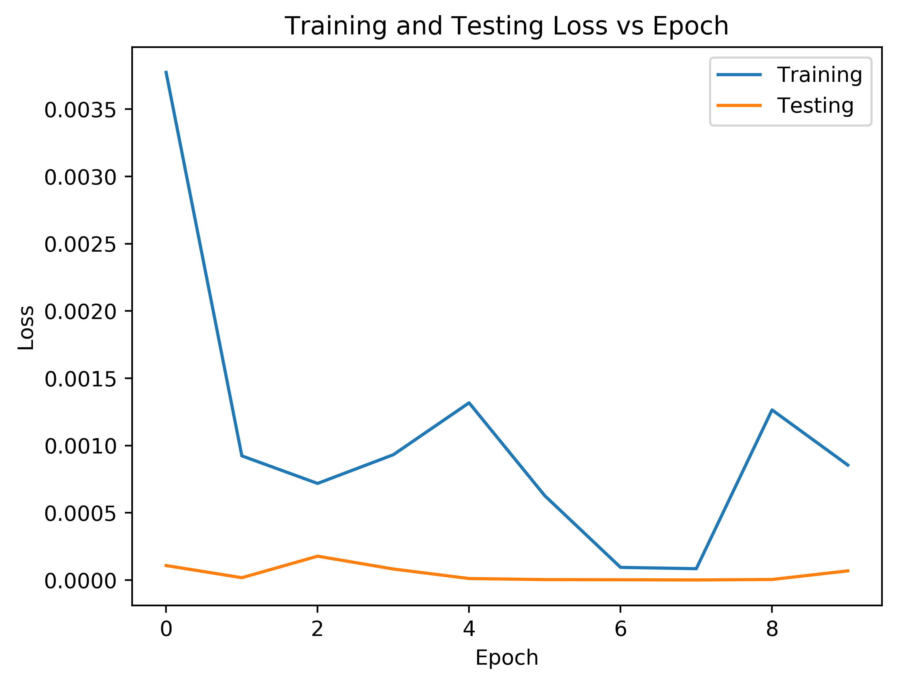
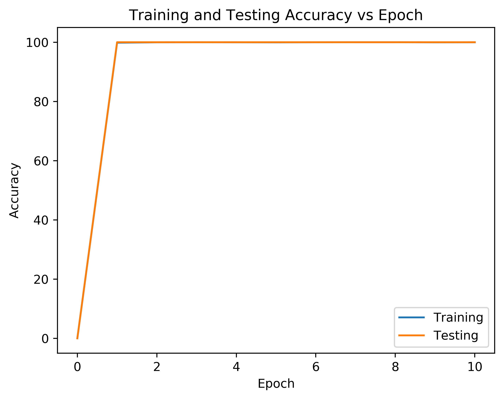

# Classifier for predicting the orientation of radiographs

## Sorting views
For sorting the data the script `sort-directory.py` is given. This will accept as a parameter path to the data as a necessary parameter, and gives optional parameters of an output directory, and model path.

The path to the data should be a path to a directory with the following structure:
<pre><code>data
├── ACC_NUM1
│   ├── AMSE0001
│   │   ├── radiograph1.png
│   │   └── radiograph2.png
│   ├── AMSE0002
│   │   ├── radiograph1.png
│   │   └── radiograph2.png
│   └── KeyImages
├── ACC_NUM2
└── ACC_NUM3</code></pre>

If an output directory is not given one will be created as follows:  
If the data path is `/path/to/data/`, then `/path/to/sorted-data/` will be the created output directory.

The model path is set to be default of `checkpoints/last.pth`.

The overall usage is given as below:
<pre><code>Usage: sort-directory.py [-h] [--output_dir OUTPUT_DIR]
                         [--model_path MODEL_PATH]
                         datapath

Arguments for training

positional arguments:
  datapath              Path to where data is stored. See README.md for
                        desired directory structure.

optional arguments:
  -h, --help            show this help message and exit
  --output_dir OUTPUT_DIR
                        If given where the data will copied to be stored.
  --model_path MODEL_PATH
                        Path to file which stores the model state dict.</code></pre>

## Training the model
The code to train and test the models accuracy is called `main.py`. The best model was trained for 10 epochs and is stored at `checkpoints/last.pth`. Below are some plots of the accuracy and the loss obtained when training on a subset of the [CheXpert](https://stanfordmlgroup.github.io/competitions/chexpert/) dataset by Stanford.

Below is the usage for training / testing the model
<pre><code>Usage: main.py [-h] [--data DATA] [--lr LR] [--epochs EPOCHS] [--batch BATCH]
               [--checkpointdir CHECKPOINTDIR] [--train] [--test] [--plot]
               [--prefix PREFIX] [--load]

Arguments for training

optional arguments:
  -h, --help            show this help message and exit
  --data DATA           Path to where CheXpert data is stored
  --lr LR               Learning rate
  --epochs EPOCHS       Number of epochs to train
  --batch BATCH         Batch size to use while training
  --checkpointdir CHECKPOINTDIR
                        Path to checkpoint directory
  --train               Flag to train
  --test                Flag to evaluate on test data
  --plot                Flag to generate plot of score
  --prefix PREFIX       prefix for model to load ("last" or "best")
  --load                Flag to load a model</code></pre>